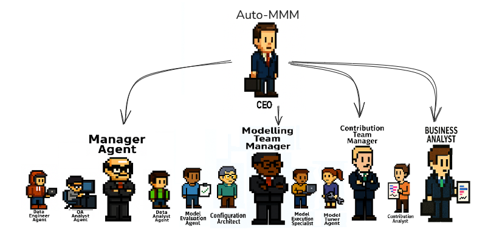
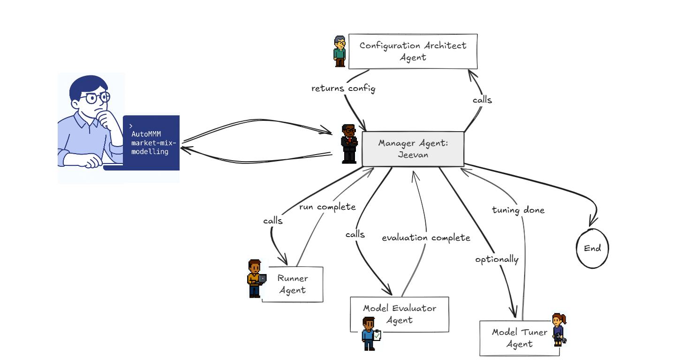
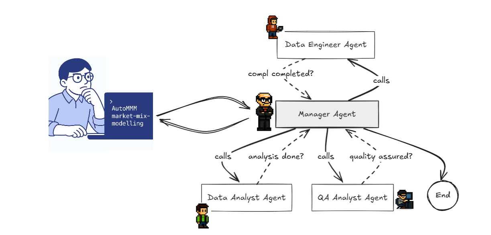
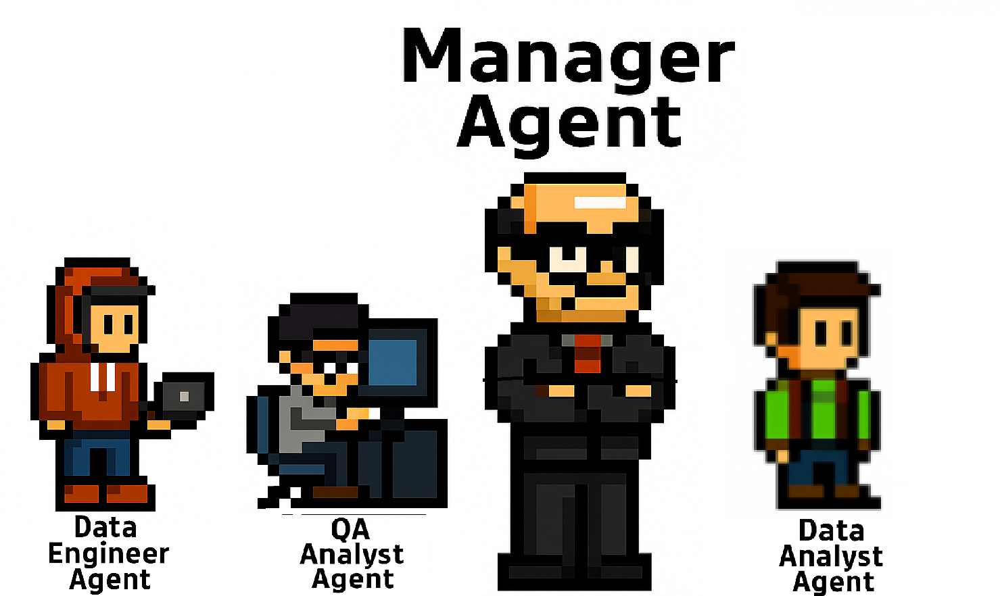
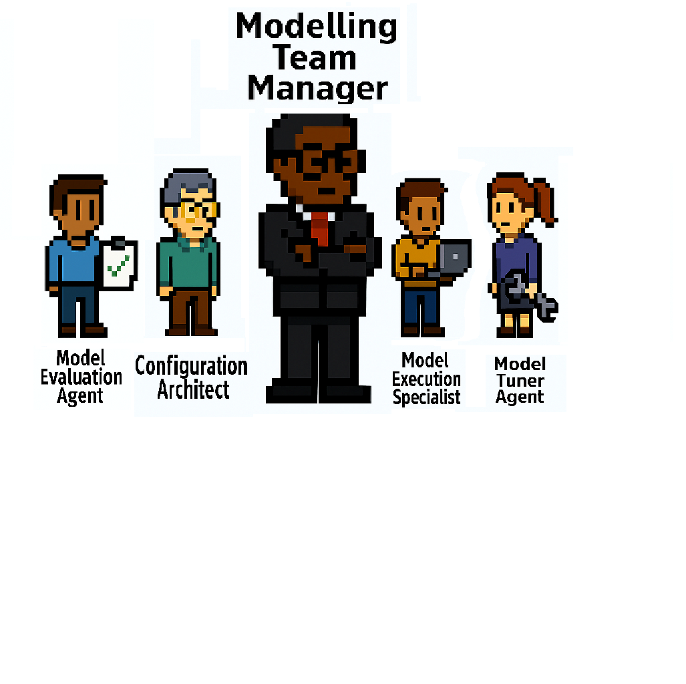
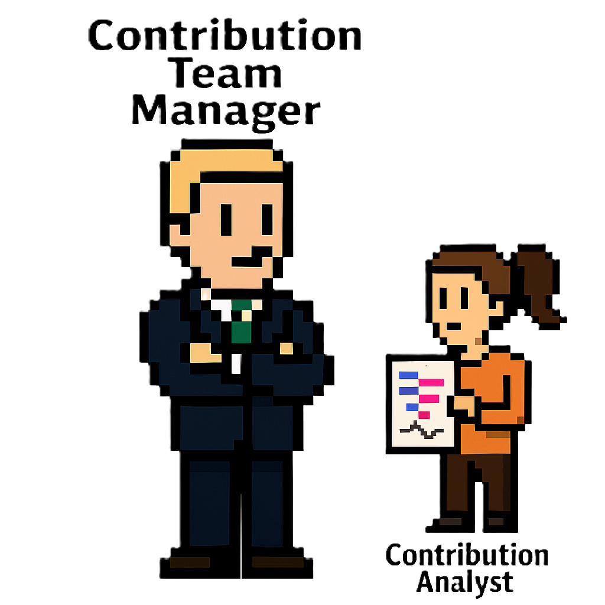

AutoMMM – Agentic Market Mix Modeling, End‑to‑End

Turn your spreadsheet into a Hierarchical Bayesian MMM with a crew of specialized AI agents. AutoMMM orchestrates data onboarding, validation, configuration, model execution, evaluation, and tuning — all from a friendly, interactive CLI.

### Why AutoMMM
- You already have data in Excel, but getting to a trustworthy MMM is slow and brittle.
- Configuration is tedious, running models is error‑prone, and results need careful interpretation.
- AutoMMM applies an agentic workflow to automate the boring parts and guide you through critical decisions.

### Highlights
- Agent crew with clear roles: Data Engineering, Configuration Architect, HBR Runner, Evaluator, and a Manager to coordinate them
- Hierarchical Bayesian Regression (HBR) runner integration
- Interactive, step‑by‑step CLI with approvals, edits, and re‑runs
- Robust data validation toolkit (duplicates, types, date formats, coverage, seasonality, and more)
- Memory + RAG context so agents “remember” your business and data choices
- One‑click exports: Excel summaries, PDFs, plots, and serialized artifacts

## Visual Overview

Place the following images in `assets/images/` (filenames shown below). The README will render them automatically.


_AutoMMM crew: Manager Agent, Modelling Team Manager, Contribution Team, and Business Analyst._


_Interactive loop: Manager → Configuration Architect → Runner → Evaluator → optional Tuner → End._


_Data onboarding supervised by the Manager Agent with Data Engineer, Analyst, and QA._


_Manager Agent with Data Engineer, QA Analyst, and Data Analyst._


_Modelling Team Manager with Configuration Architect, Model Execution Specialist, and Model Tuner._


_Contribution Team Manager and Contribution Analyst._


_Business Analyst stakeholder view._


_Executive sponsor._

---

## Architecture at a Glance

The project uses LangGraph to build a graph of collaborating agents.

- Modelling Team Manager (`agents/ModelRunnerTeam/ModellingTeamManager.py`)
  - The conductor. Talks with you, calls other agents, and loops through run → evaluate → tune.
- Configuration Architect (`agents/ModelRunnerTeam/configuration_architect.py`)
  - Designs and finalizes model configuration and runner metadata.
- Runner Agent (`agents/ModelRunnerTeam/ModelExecutionSpecialist.py`)
  - Executes the HBR model via an external runner script, logs progress, and materializes outputs.
- Model Evaluator (`agents/ModelRunnerTeam/ModelEvaluationSpecialist.py`)
  - Interprets performance, coefficients, and contributions, and recommends tuning.
- Data Team (`agents/DataHandlingTeam/*`)
  - Data Engineer loads Excel, captures context, and persists it in memory.
  - Data Quality tools and structured responses support extraction and validation.

Support modules:
- Tools and Validators (`tools/tools_data_analysis.py`): rich suite of data checks and helpers
- Memory Store (`utils/memory_handler.py`): in‑process store for DataFrames and strings
- Theme/Console utilities (`utils/theme_utility.py`): delightful CLI experience
- Agentic RAG (`agent_patterns/agenticRAG`): contextual memory access for smarter decisions

---

## Project Layout

Key files and folders:
- `main.py`: interactive entrypoint (Manager‑driven workflow)
- `user_inputs/`: model inputs and configuration (
  - `model_config.xlsx`, `column_config.xlsx`, `config.py` (auto‑generated)
)
- `output/`: run artifacts (Excel, PDFs, plots, pickles)
- `prompts/`: agent prompts and user messages
- `agents/`: agent implementations (Data team, Runner, Evaluator, Manager)
- `tools/`: validation and analysis tools used by agents
- `utils/`: I/O, memory, and UI helpers

---

## Requirements

- Python 3.10+
- Ollama (local LLM) if using `ChatOllama` (default): `llama3.1`
- Optional APIs (if you enable them):
  - OpenAI (`OPENAI_API_KEY`)
  - Groq (`GROQ_API_KEY`)
  - LangSmith (telemetry): `LANGSMITH_API_KEY`

Install Python dependencies:

```bash
pip install -r requirements.txt
```

Set environment variables (create a `.env` in the repo root):

```bash
GROQ_API_KEY=
OPENAI_API_KEY=
LANGSMITH_API_KEY=
```

If using Ollama, install and pull the model:

```bash
ollama pull llama3.1
```

---

## Quickstart

1) Place or verify your data
- Default expected dataset: `data_to_model.xlsx` with sheet `Sheet1` (see `config.py`).
- Or use the Data Engineer flow to load any Excel and capture context.

2) Configure the runner path
- The Runner Agent invokes an external script to train/evaluate the HBR model. Update the path in:
  - `agents/ModelRunnerTeam/ModellingTeamManager.py` → `RunnerAgent(..., runner_path=...)`
- Point it to your HBR runner (e.g., a numpyro/stan/pyro script). The repo also includes `synthetic_data_generation/runner.py` for demo purposes, but the default points to a local path. Change it to match your environment.

3) Run the CLI manager

```bash
python main.py
```

You’ll chat with the “Modelling Team Manager.” It will:
- Introduce the crew and ask what to do
- Gather or refine configuration
- Optionally call the Data Engineer to load/contextualize data
- Execute the HBR model via the Runner
- Evaluate and explain results
- Offer a tuning loop if performance or stability can improve

Outputs appear under `output/` with per‑iteration folders containing plots, Excel summaries, contributions, and pickles.

---

## Data Validation Toolbox (selected)

The manager and data team agents call tools from `tools/tools_data_analysis.py`, including:
- `generate_validation_summary`, `data_describe`
- `validate_column_name_format`, `validate_date_format`, `validate_data_types`
- `duplicate_checker`, `validate_time_granularity`, `raise_validation_warnings`
- Product‑level checks: nulls, duplicates, time coverage, outliers, price consistency, OOS vs Sales sync, seasonality, media‑sales correlation

These help spot anomalies early so your model is stable and interpretable.

---

## Configuration

- Base input pointers live in `config.py` (reads `data_to_model.xlsx`).
- Interactive configuration is orchestrated by the Manager and the Configuration Architect.
- The Manager writes `user_inputs/config.py` just before model runs; `user_inputs/model_config.xlsx` stores feature settings.
- Update the `runner_path` to your local training script.

Tip: Keep `user_inputs/` in source control to track modeling choices over time.

---

## Outputs

Expect artifacts like:
- `output/analysis.xlsx`, PDFs (`data_summary.pdf`, `final_llm_report.pdf`), and charts
- Iteration folders (e.g., `output/Iteration_itr1/`) with:
  - Model pickles, AVP plots (train/val), VIF combinations, row‑wise contributions
  - Correlations, model summary, trace plots, and variable pickles

---

## Troubleshooting

- Runner path error
  - Update `runner_path` in `ModellingTeamManager.py` to a valid Python script on your machine.

- Missing DataFrame in memory (DataStore error)
  - Use the Data Engineer flow to load your Excel, or ensure `config.py` successfully reads `data_to_model.xlsx`.

- Ollama connection / model not found
  - Make sure Ollama is running and `ollama pull llama3.1` has completed.

- API keys
  - If you enable OpenAI/Groq, set keys in `.env`. Otherwise the system uses local `ChatOllama` by default.

---

Made with care for practitioners who want fast, reliable MMMs with human‑in‑the‑loop judgement.


